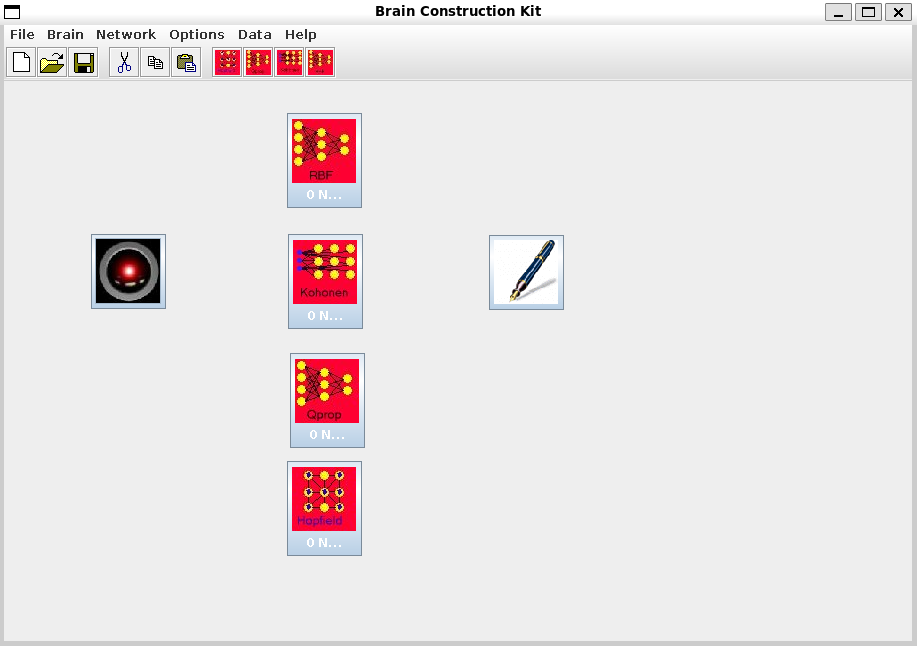

# BCK
The BCK (Brain Construction Kit) was written in 1997 as a final year undergraduate project in Computer Science at Dublin City University.

## Installation

For UNIX systems:

In order to run the BCK applications, you should add the following to your
~/.cshrc file
assuming that the BCK directory is located at:
/home/users/me/BCK

1. Amend the PATH entry so that it includes /home/users/me/BCK/bin
2. Amend the CLASSPATH entry so that it includes 
/home/users/me/BCK/classes
and
/home/users/me/BCK/classes/swingall.jar

Secondly, you must edit the 'bck' script in the BCK/bin directory so that it reads:

java -DBCK.home=/home/users/me/BCK/classes/BCK/GUI/ -mx100m -oss1m -ss1m -ms10m BCK.GUI.bck

now type:

source ~/.cshrc
rehash

and to run the application type

bck

For windows systems:

Amend the CLASSPATH and PATH environment variables as described for UNIX, with the dos 'set' command or equivalent in the autoexec.bat file.
amend the bck.bat file in the BCK/bin directory in the manner described for the
bck script in UNIX above
to run the Brain Construction Kit type 

bck 

## User Manual

### Introduction

The Brain Construction Kit (BCK) is a software application that enables users to create, train, modify and use Artificial Neural Networks (ANNs). The BCK consists of two main parts, the first is the BCK.ANN package, which provides programmers with a powerful set of classes which may be used by any Java application wishing to harness the power of neural networks. The BCK.ANN is the core of the BCK, as it is through this package that neural networks can be created and manipulated.

The second part of the BCK is the graphical user interface. This package is referred to as BCK.GUI. BCK.GUI provides a flexible and user friendly interface to most of the features and functionality offered by the BCK.ANN package. In particular, the GUI provides users with the ability to present ANN features in graphical form, so that a greater understanding of ANN dynamics can be achieved.

This User Manual deals with interaction with the BCK via the GUI. Information for Java programmers can be obtained from the Technical Manual, and source code listings.

In this manual 'Network', 'Neural Network', 'Artificial Neural Network', and 'ANN' are taken to be synonymous.

Similarly, 'Neuron', 'Node' and 'Unit' all refer to an Artificial Neuron, the basic component of the ANN.

### Getting Started
 

Download the BCK.jar file, read the README file at the same location for more details.

### Installation

The entire BCK system is contained in the BCK.jar file, but files must be extracted before the system may be used. To extract the files, use the 'jar' archiving command (available with the JDK) to extract the files into whatever location you want. After unjarring the file, there will be a number of directories created:

Bin - contains executable programs

Classes - contains all the classes needed for the BCK

Src - contains the source code of the classes

Examples - contains some examples of networks created using the BCK, training and testing data

Doc - contains documentation relating to the BCK.ANN api.

### Setup

Before the BCK is executed for the first time on a new system, certain system specific data must be supplied. If you are in a Windows NT environment, you will need to edit the 'bck.bat' file in the 'BCK\bin' directory. In this batch file there is a single command, 'java' but there is also a large amount of paths and parameters. You will need to change 'g:\jdk1.1.5\java' to whatever the full path to the java command is on you system. You will then need to alter the -D option, and specify the full path to the \classes\BCK\GUI directory. The BCK.home parameter is used by the BCK in order to locate files it needs such as image icons. If you do not specify the BCK.home parameter correctly, images will not load an the GUI will make little sense.

The final and most critical parameter is the '-classpath' parameter. You must specify 3 paths separated by semicolons after this parameter. Firstly, specify the full path and filename of the 'classes.zip' file on your system. This is usually stored somewhere in your jdk installation. Secondly specify the full pathname of the 'swingall.jar' file, and thirdly the path to the 'classes ' directory within the BCK installation.

Do not alter any other parameters, as they are critical to the correct operation of the BCK, unless you are extremely familiar with their use.

For users in a Unix environment, the 'bck' file in the 'bin' directory contains a command line which launches the BCK. Again, you will need to modify the parameters as for Windows NT users.

Solaris and Windows NT Compatibility Issues

While Java is theoretically completely platform independent, there inevitably remain a few incompatibilities especially in the GUI. BCK was developed under Solaris CDE, using jdk1.1.5, and therefore runs exactly as intended under that environment.

During testing, the BCK was ported to Windows NT. With jdk1.1.5, BCK runs very much as intended, the only glitches appearing in the GUI. Sometimes the screen does not repaint properly, and becomes a jumbled, but clicking on 'Refresh' in the 'Options' menu usually sorts this out. Otherwise the operation of the BCK under this environment seems stable. Due to an error in the setup of the Solaris environment in which development was performed, in Windows NT, you must hold the 'alt' key and click the mouse to simulate a right click.

The BCK uses the new graphical system called 'Swing'. Swing is not compatible with all versions of the jdk, and therefore neither is the BCK. It is recommended that JDK1.1.5 or later be used.

During testing, BCK was executed under JDK1.2 Beta Release. Apart from a known bug (in JDK1.2) which causes problems with colours under Windows NT, the BCK worked fine.

 

### Basic Operations

Neural Networks are reasonably simple entities, however we do not intend to impart the basics of their operation in this manual. There are hundreds of books and websites dedicated to this task.

It is assumed therefore that the user has a grasp of what ANNs are, if not consult any web search engine for introductions to ANNs / Connectionism.

#### Creating A Neural Network

To create a neural network, go to the 'Network' menu, and then to the 'Add' option, and then select the architecture of network you want to add from the list in the submenu. This will cause a dialog box to appear within which you may supply the details of the network you want to create.

Refer to the appendices for details of the parameters required for the various architectures.

For the rest of this chapter it is assumed that you have created an MLP using the Quickprop training algorithm, with 2 inputs, 2 outputs and 1 hidden layer containing 3 neurons.

When you have supplied the required parameters, click OK. After a few seconds a new network icon will appear in the top left corner of the main window. The area in which the network icons are drawn is known as the 'canvas'. These icons may be moved into any position you want.

#### Editing A Neural Network

The BCK provides many graphical representations of ANN attributes, the most fundamental of which is the 'Network Editor'. To access the Network Editor, right-click (in Windows, hold 'Alt' and click) on the Network icon of the network that you want to edit. Now select the 'Edit' option from the popup menu. A window now appears containing a picture of the neurons in your network, represented by square yellow and red icons. Each Neuron is given a number, which is displayed on the icon. This number is important as it determines the order in which neurons are arranged in the network, and therefore which neurons evaluate their input before others.

In order to see the connections between networks select the "Show Connections" option from the 'Options' menu. If there are less than 1000 connections in your network, you will now see blue and red lines of various thickness joining the neuron.

A blue line indicates an inhibitory link, that is, a link with a negative weight. A red line indicates an excitatory link, that is, a link with a positive weight. The thickness of the line indicates the magnitude of the weight.

Weights for an MLP are initialised to small random values, so initially there will be little structure apparent in your network.

You may leave the Network editor open during training, and through it, observe how the weights change as the network adapts its structure.

 
#### Training & Testing A Neural Network

To train your network, right-click on the Network Icon. Choose the 'Train' option. A large dialog will appear. There are many options on the MLP Quickprop training dialog, but its usage is relatively straightforward.

The first step is to specify a file containing training data. Training data files consist of a large number of records. Each record must contain a field for each input and output of the network being trained. Therefore to train the MLP described in the previous section, we will need training data with four fields per record.

The BCK imposes a very simple file format. Each field is a number (written in text), and fields are separated by spaces or end-of-lines. There is no record separator, since the number of fields per record is assumed to be exactly the same as the number of network inputs plus outputs.

For simplicity, we will begin by training the MLP on a very simple data set. The and2.dat file contains four records with four fields in each record as follows :

0.0 0.0 1.0 0.0

0.0 1.0 1.0 0.0

0.0 1.0 1.0 0.0

1.0 1.0 0.0 1.0

The structure of the file is as follows: the first two fields in each record specify the input to the network. The second two fields specify the desired output. Therefore, the first line in the file contains a record which specifies that for the input vector (0.0,0.0) the desired output vector is (1.0,0.0). It can be seen that this set of records can be used to teach the network the logical AND function. The first output neuron should have an output close to 1.0 when the input vector describes two variables which when ANDed together give a logical value of 'false'. The second output neuron should have a high output (high = close to 1.0) when the input vector is (1.0,1.0), and a low output (close to 0.0) for any other values.

The and2.dat file is supplied with the BCK in the DATA/TOY directory. To use it to train the MLP, click the 'Browse' button located to the right of the Training File text box. A file dialog will appear, and you may select the and2.dat file in the usual manner.

Beneath the Test File textbox lies the parameters textboxes. These accept parameters which modify the behaviour of the Quickprop training algorithm. They are named rather cryptically, Mu and Epsilon, from the names of the mathematical symbols used by Scott E. Fahlman, the developer of the Quickprop algorithm. Set the Mu parameter to 0.3, and the Epsilon parameter to 1.1. Consult the web, or any good neural network book for explanations of the effect of these parameters. Their theory behind their effect is quite complex and mathematical, but the above values seem to work quite well for a range of applications. Setting such parameters is more of an art than a science, and the best policy seems to be to try a few different combinations to get a feel for their effects.

The next step is to specify the number of epochs for which you want to train the MLP. An epoch is an entire run through the training set. For the moment, set this (the text box labelled 'Train For:') to 200.

Now we are ready to begin training. Click the 'Train' button beside the 'Train For' text box. Since the training set is simple and the network is small, each epoch takes a tiny fraction of a second. You will see a curved line in the white rectangle at the bottom of the dialog. The height of this line represents the global error. Additionally, the exact global error is printed at the bottom of the graph at the end of the training run.

If you have entered the parameters correctly the curve should quickly reduce in height to a tiny amount. This is due to the fact that the AND logical function is easy for ANNs to learn. However, since weights are initialised to random values, the exact results of the training will be different every time. If the global error fails to fall to a very small value (<0.1) then hit the 'Restart' button. This re-randomises the weights and allows you to begin training the network from scratch.

Beneath the 'Train For' text box are two text boxes used to specify a slightly more complex training system. You can specify the maximum number of epochs to train for, or the value of global error you want to reach. This system is used for training runs where you know that there is a chance that the network will fail to converge on a solution, and you want to limit the number of epochs for which it tries to converge. Secondly, it allows you to force training to stop once a good solution has been found, by specifying a low global error. This way, the chance that future training would alter the network in such a way as to increase global error, thereby erasing a good solution, is eliminated.

The final feature of the MLP training dialog is the testing facility. This allows you to specify a file containing test data, i.e. inputs and desired outputs in the same format as the training file, by clicking the 'Browse' button to the right of the Test File text box. After specifying the test data file, click on the 'Test' button beside the 'Restart' button. This causes each record in the test file to be fed into the network. The network's response is then compared with the desired response specified in the test record. A correct response is deemed to be one in which each output is within 0.2 of the desired value. The percentage of correct responses is then printed in the Test Score text box.

 

#### Saving A Neural Network

In order to save a network, click on it so that it is coloured blue (as opposed to the usual red). Then select 'Save' from the Network menu. Enter an appropriate filename in the dialog box and click OK. For large ANNs, the saving procedure may take some time.

#### Loading A Neural Network

Select 'Load' from the Network menu. Enter the file containing the network that you want to load. An icon representing the network will appear in the top left corner, as though you had just created the network in the usual manner.

#### Saving A System

When you have more than one network open at the same time, and when you have connected networks to brain inputs/outputs or to each other, you must save the entire system in order to preserve the links between networks. To do this, select 'Save' from the File menu, or click on the disk icon on the toolbar.

#### Loading A System

To load a system, select the Open option from the File menu. Select the file containing the system you want to load. For large systems, it may take a long time to load the entire system.

### Intermediate Operations

#### Examining Neuron Function (2d-maps)

The 2-d map is a graphical representation of the behaviour of a neuron under the influence of two others. Right click on the Network icon whose behaviour you want to examine. Select the edit option to display a pictorial representation of the Network. Right click again, this time select the 2-d Map option from the popup menu. A dialog will appear containing the fields Input X axis node, Input Y axis Node and Output Z axis node. Enter the id number of the first input node in the X axis box. Enter the second id in the Y axis box. Enter the id of the neuron whose behaviour is determined by the values coming from the two input nodes in the Z axis node box.

For the AND MLP example described in the previous section, you would enter 0, 1 and 5 respectively, in order to observe how the values of the two input nodes influence the behaviour of the output node which is supposed to be detecting NAND. Next click 'Zoom Out' once. This will change the range of values tested to -2.0 to +2.0. Now click 'Draw'. The output of the specified output (Z axis node) is plotted as variation in colour. Each point on the plane corresponds to a different 2-element input vector. Bright colour for a point indicates that the output node is 'high' or close to 1.0 for the corresponding input vector, while dark values indicate a 'low' output. The bottom left hand corner of the plot corresponds to the co-ordinates (-2,-2) while the top right hand corner corresponds to (+2,+2). A crosshair is drawn when the plot is complete, the intersection of the two lines of which marks the origin point (0,0).

#### Manually Editing Networks

The Network Editor is a powerful tool with which you can alter the weights of interconnections between neurons in a network, create new connections, remove existing connections. This functionality is accessible through the popup menu associated with the neuron icons. By right-clicking on a neuron icon (hold Alt and click in Windows), a popup will appear with two options, 'Connect To' and 'Show Details'.

Selecting the 'Connect To' option causes a simple dialog to appear, containing the fields 'Neuron', 'Weight' and 'Delay'. The neuron field accepts the id number of the neuron which you want to take an input from and feed it into the neuron you right-clicked on. The weight field allows you to specify the weight of the created connection. The delay field allows you to specify a delay of up to 10 time units. This last option should be set to zero for normal operation. When you click OK, the specified connection is created, and if you have selected the 'Show Connections' option in the Network Editor, you will immediately see a new line representing the new connection.

Selecting the 'Show Details' option from the popup menu causes a more complex dialog to appear.

The first field displayed is the Neuron Name field. In this you may enter any name you wish. Generally this is used to label the output nodes in a network. For instance, in the AND MLP example, we would label neuron 5 'NAND', and neuron 6 'AND', since these are the classes they represent.

The second field is the neuron Type. The BCK supports the following types of neuron: Linear, Sigmoid, Binary, Bipolar, and Radial.

The table at the bottom of the dialog displays descriptions of the inputs to the neuron. These may be edited manually, or removed via the remove button upon pressing OK, the changes you make to the information in this table will be reflected by the network.

For neurons in an MLP, the first entry in the table will describe a neuron with id = -1. This neuron is known as the 'bias' neuron. It is not really part of the network, but it provides a constant output of +1 which is fed into all other neurons in the network, as this results in desirable mathematical properties.

The table preovides exact details of the inputs to a neuron. However, for neurons with a large number of inputs, a graphical representation is often more appropriate. Many neurons especially in visual recognition applications have inputs which represent a graphical entity. This information can be plotted by pressing the 'Draw' button. However, you must first specify the width of the 'rectangle' of weights so that the plot will be accurate. The third field, Width of Matrix, allow you to do this.

### Text Data Processing

Most databases of information useful to the Neural Network practitioner are not in the format that the BCK requires. The 'Text' option in the 'Data' menu gives access to a dialog which may be used to convert textual data files into a format suitable for use as training data in the BCK. The file to be converted must however consist exclusively of space delimited numbers.

The function of the fields in this dialog can be described as follows:

Number of Fields per Record - this field should contain the number of space delimited numbers in each input file record.

Output EOL After - This field allows you to specify the number of fields per line in the output file.

Replace Field - This field accepts the number of the field in the input file records which is to be replaced.

With - this field allows you to specify a string of space delimited numbers which will be outputted in place of the field specified in 'Replace Field'

Input File - use the browse button to specify the input file from which the original data is to be read.

Output File - use the browse button to specify the file to which the transformed data is to be written

### Image Processing

Face recognition is one of the main areas of application of ANNs. Face databases such as the ORL database (available on the Web), consist of .gif or .jpg images. The Image conversion dialog allows you to read in a group of images (of the same person's face) and output all of the images to a single file. The images are converted to arrays of greyscale values between 0 and 265. They are also reduced in size by a 4 to 1 ratio.

The output vector text box allows you to specify a string of digits representing the desired output vector of your network. The output vector you specify will be written to file after every image is written. Many applications require output vectors consisting of all zeros and a single 1. The position of the 1 indicates the class to which the image belongs. It can be error prone and monotonous to type such a vector in, so there are two text boxes and a button which permit this procedure to be automated.

## Advanced Operations

### Configuring the Brain

The Brain is the collection of networks in a system, and overall inputs and outputs. In many ways it is simply a neural network which may contain other neural networks. It has an input layer of neurons and an output layer. Configuring the brain consists solely of specifying the number of inputs and outputs.

### Connecting Networks

In multi-network systems, you will generally want the output of one network to provide the input to another network. To do this, right-click on the network which will be taking the output of another network as its input. Choose the 'Connect' option.

A dialog will appear. The first label specifies the number of the network which will be taking the output of another network as its input, this is called the target network. The first textbox allows you to specify the number of the network whose output you want to use as input, this is the source network. Enter the number and click the 'Load' button. The table now lists all of the output neurons in the source network, and the neurons in the target network to which they are connected. A -1 entry for a Target ID indicates that the source neuron is not connected to any neuron in the target network. By editing the entries in the table, you can connect source neurons to target neurons with links with whatever weight and delay you want.

Upon clicking 'Apply', the edits you have made are applied. A white line will appear connecting the right hand side of the source network to the left hand side of the target network, indicating that there is a feed-forward relationship between the two.

In order to connect a network's inputs to the inputs of the entire brain, specify an Source Network Id of 0. The brain object is in fact also a Neural network object, which is stored in the brain object! The only difference is that when you specify a source id of 0, the brain inputs are displayed in the table as opposed to the outputs. The 'Hal's Eye' icon represents the brain inputs, and when you connect a network's inputs to the brain inputs, a line will be drawn from this icon to the target network icon.

In order to connect the overall brain outputs to the output neurons of a component ANN, you must select the 'Configure Outputs' option in the 'Brain' menu. The by now familiar dialog for connecting networks will appear, and can be used as normal. 

### Classification and Data Processing

The whole point of Neural Networks is that they can be used to classify data which they have not seen before with relatively high accuracy. Right-click on the AND MLP and choose the 'Classify' option in the popup.

A dialog will be displayed with the following components:

File Contains Input Fields Only - This Check box allows you to specify whether the file of input data contains records corresponding to input and output vectors, or input vectors alone.

Input File - Via the Browse button, specify a file containing data to be classified. For testing purposes, the file can simply be a file of training data, containing records of input vectors and output vectors, or more typically it can contain records of input vectors only.

Number Of Records - After loading the input file, the number of records read will be displayed here.

Record Number - Displays the current record number.

Load Button - Displays the current record.

Next Button - Displays the next record and classifies it.

Width - Similar to the 'Width of Matrix' Field in the neuron details dialog box, this field allows you to specify the width of the image which will be drawn to represent the input. For instance, if you were classifying images of digits, and they consisted of an 8 x 8 array, setting the width to 8 will cause the image to be displayed properly.

Classify Button - Classify the current record.

Class Text box - Displays the name of the output neuron which had the highest output in response to the last input record classified.

Output File - Via the Browse button specify the file to which output is to be written in batch mode classification.

Print Input Records Checkbox - Selecting this checkbox will cause input records to be printed to file before their corresponding classification is printed to file in batch mode classification.

Print Class Name Checkbox - by default, the output vector of the network is printed to file in batch mode processing. By selecting this checkbox, you can override this behaviour and cause the name of the neuron with the highest output to be printed instead.

The table at the bottom of the dialog displays descriptions of the output neurons of the current network including their name, id and output.

### Creating Your Own Architecture

With a combination of the Network Editor and the Brain facilities for interconnecting networks, it is possible to create networks and systems with architectures not immediately supported by the BCK.

For example, many practitioners find that an MLP will train more quickly if weights (inter-neuron links) are 'pruned' (deleted). This is very straightforward with the Network Editor.

Shortcut connections in an MLP are also useful for certain applications, and can easily be shown to speed convergence with the quickprop algorithm. Simply put, a shortcut connection is a connection from a neuron in one layer to a neuron in a layer more than one layer towards the output layer in an MLP. This is obciously very easy to accomplish using the 'Connect To' option in the neuron popup menu via the Network Editor.

Many image recognition applications take advantage of what are known as 'Convolutional' layers of neurons. In this system, each node a layer of a network shares the same set of weights. This can be simulated as follows: train an MLP with a single output node and the appropriate number of (say m) inputs. Copy this MLP (via the copy icon in the toolbar) and paste it. If you want an aggregate input layer of n neurons paste the MLP n/m times. Now configure the brain so that it has n inputs and o outputs. Connect each input neuron in the pasted MLPs to the appropriate neuron in the Brain input layer via the Connect Networks facility (right-click on the network icon, then select 'connect'). Now create an MLP with n/m inputs, and o outputs. Connect its input layer to the output neurons of the pasted MLPs, and connect the brain output neurons to its outputs.
